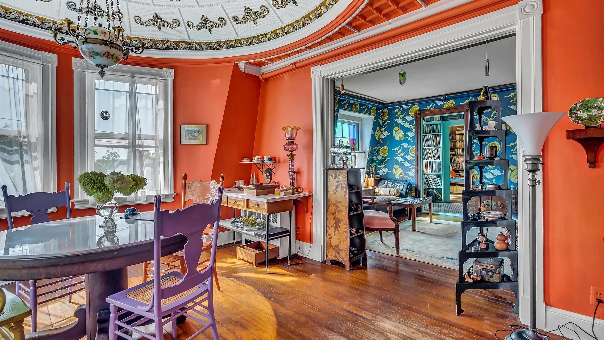
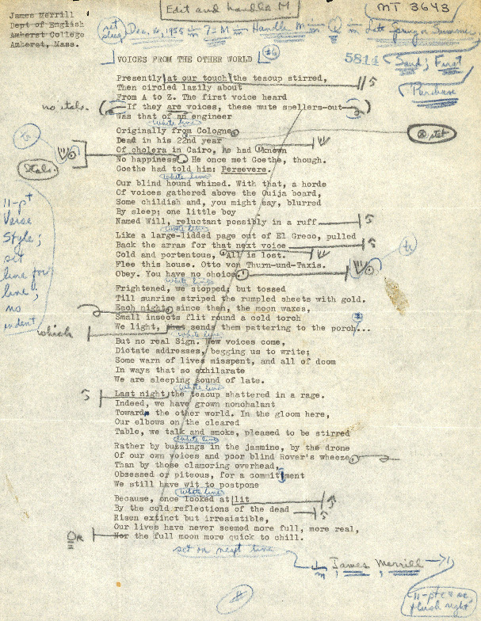

## This is Sandover.
  

>“Backdrop: The dining room at Stonington.  
Walls of ready-mixed matte “flame” (a witty  
Shade, now watermelon, now sunburn).  
Overhead, a turn-of-the-century dome  
Expressing white tin wreathes and fleurs-de-lys  
In palpable relief to candlelight.  
Wallace Stevens, with that dislocated  
Perspective of the newly dead, would take it  
For an alcove in the Baptist church next door  
Whose moonlit tower saw eye to eye with us.  
The room breathed sheer white curtains out.”  
~ James Merrill, _The Changing Light at Sandover_

 
 
 

A custom theme for <a href="https://www.obsidian.md">Obsidian.</a> Sandover is inspired by the spaces in which great works are written and the tools used to write them. The simple design replicates the typewritten page. Accent colors come from the vibrant Stonington, CT home of Pulitzer Prize-winning poet James Merrill and his partner, David Jackson. Their home is one of the primary settings of his (their?) epic *The Changing Light at Sandover.* I created this theme for myself after a few years of using Obsidian for my research notes. One of Obsidian's biggest drawbacks, for me, is the inability to add comments to the text. I adjusted the base theme settings so that I can leave comments by using blockquote syntax. In Sandover, blockquotes are rendered as indented blue text, so you can easily see them while typing. It's not fancy and won't work for everyone, but I hope that it will fulfill other users' needs as it does mine. The theme is for poets, novelists, academics, and writers of all kinds to use.

### Recommended plugins
* Better footnote
* Better Word Count
* Footnote Shortcut
* Longform
* Pandoc Plugin
* Pandoc Reference List
* Smart Typography
* Typewriter

  

 

Merrill, James, “Merrill Ouija Notebook Material,” <i>Digital Gateway Image Collections & Exhibitions</i>, http://omeka.wustl.edu/omeka/admin/items/show/6765.

