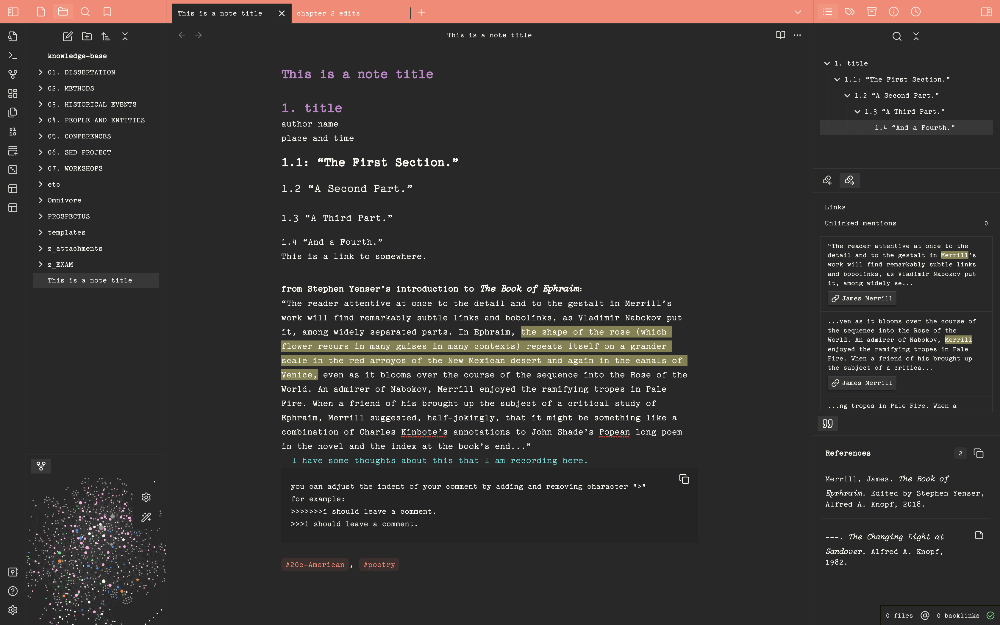

## This is Sandover.

A custom <a href="https://www.obsidian.md">Obsidian</a> theme. Sandover is inspired by the spaces in which great works are written and the tools used to write them. The simple design replicates the typewritten page and uses the font TT2020. Accent colors come from the vibrant Stonington, CT home of poet James Merrill and his partner, David Jackson. Their home is one of the primary settings of his epic <i>The Changing Light at Sandover.</i> I created this theme for myself while using Obsidian for my research notes. I wanted an inspiring workspace and the ability to add comments. In Sandover, you can leave blue comments by using blockquote syntax, so that you can easily see them while typing. It's not fancy and won't work for everyone, but I hope that it will fulfill other users' needs as it does mine. The theme is for poets, novelists, academics, and writers of all kinds to use. 

### Recommended plugins
* Better footnote
* Better Word Count
* Footnote Shortcut
* Longform
* Pandoc Plugin
* Pandoc Reference List
* Smart Typography
* Typewriter

  

 

Merrill, James, “Merrill Ouija Notebook Material,” <i>Digital Gateway Image Collections & Exhibitions</i>, http://omeka.wustl.edu/omeka/admin/items/show/6765.

